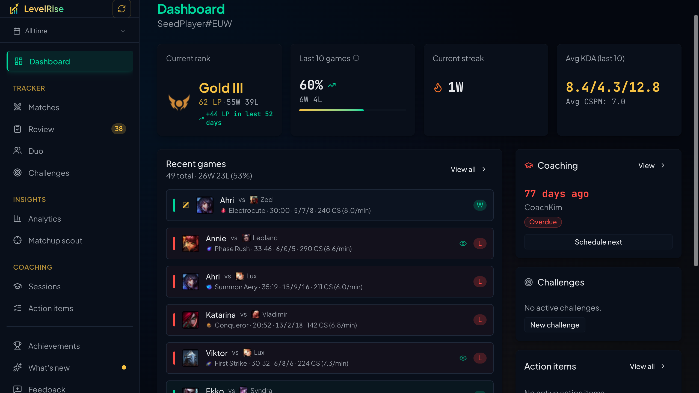
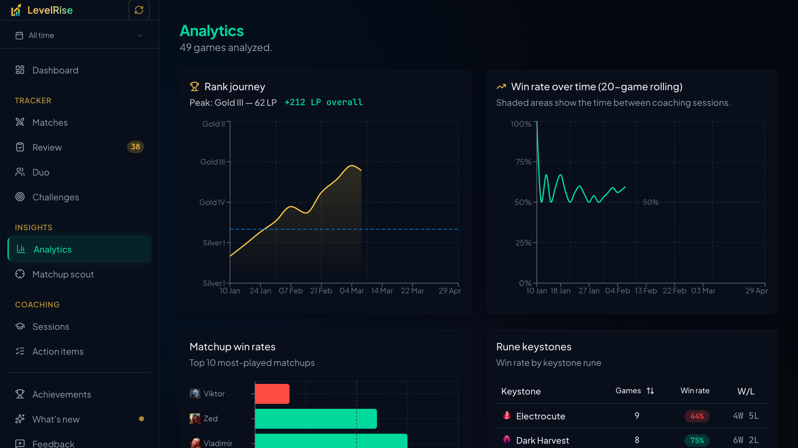
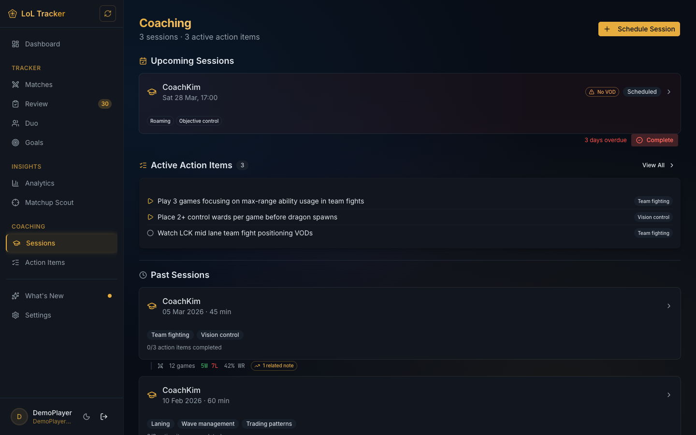
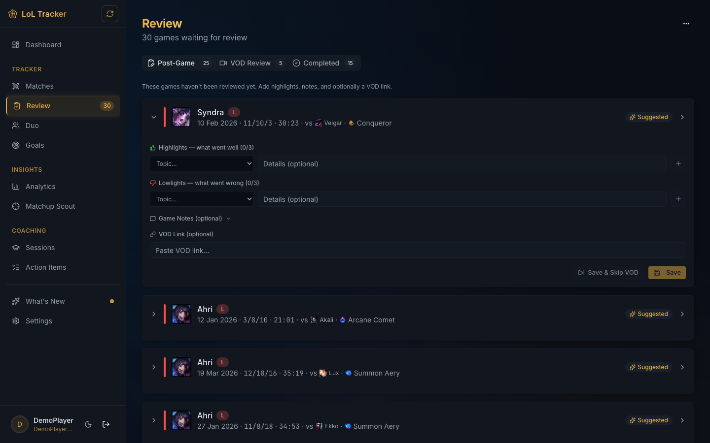

# LevelRise

> Formerly known as lol-tracker

[](https://github.com/beagleknight/levelrise/actions/workflows/ci.yml)
[](LICENSE)
[](https://levelrise-sigma.vercel.app)
[](https://ko-fi.com/beagleknight)

An open-source League of Legends companion app that syncs your match history, tracks your performance over time, and gives you AI-powered coaching to help you improve. Built for players who want to take their game seriously.

**[Try it at levelrise-sigma.vercel.app →](https://levelrise-sigma.vercel.app)**



## Features

### Performance analytics

Track your win rates, LP trends, champion stats, and role breakdowns. See how your performance changes over time with interactive charts and detailed match breakdowns.



### AI-powered coaching

Log coaching sessions, get personalized feedback from AI, and track action items across sessions. The coaching system helps you identify patterns and turn insights into concrete improvements.



### Post-game review

Review your recent matches with categorized highlights — things you did well and things to work on. Focus on one game at a time or look at patterns across your match history.



### And more

- **Automatic match syncing** — link your Riot account and your match history stays up to date
- **Multi-account support** — track multiple Riot accounts (smurfs) under one login
- **Duo partner tracking** — find and analyze your performance with duo partners
- **Goal setting** — set ranked goals and track your progress
- **Matchup scout** — AI-powered advice for your next matchup
- **Bilingual** — full English and Spanish support

## Quick start

```bash
git clone https://github.com/beagleknight/levelrise.git
cd levelrise
npm install
cp .env.example .env.local    # Fill in your API keys
mkdir data && npx drizzle-kit push
npm run dev
```

See [CONTRIBUTING.md](CONTRIBUTING.md) for detailed setup instructions, including Discord OAuth configuration, demo mode, and all available scripts.

## Self-hosting

LevelRise is designed to run on [Vercel](https://vercel.com) with [Turso](https://turso.tech) as the production database, but you can adapt it to other platforms.

Each instance requires its own credentials:

- **Riot Games API key** — register at [developer.riotgames.com](https://developer.riotgames.com). Development keys expire every 24 hours; for a persistent deployment, apply for a production key.
- **Discord OAuth app** — create one at [discord.com/developers](https://discord.com/developers/applications). Set the redirect URI to `https://your-domain.com/api/auth/callback/discord`.
- **Turso database** — create a database at [turso.tech](https://turso.tech) and set `TURSO_DATABASE_URL` and `TURSO_AUTH_TOKEN` in your hosting environment.

Migrations are applied automatically on deploy via `scripts/migrate.ts`. See `.env.example` for the full list of environment variables.

## Tech stack

| Layer     | Technology                         |
| --------- | ---------------------------------- |
| Framework | Next.js 16 (React 19)              |
| Database  | SQLite / Turso via Drizzle ORM     |
| Auth      | Auth.js (NextAuth v5) with Discord |
| UI        | shadcn/ui v4, Tailwind CSS v4      |
| AI        | Google Gemini via Vercel AI SDK    |
| i18n      | next-intl (English + Spanish)      |
| Testing   | Playwright, axe-core               |
| Linting   | oxlint, oxfmt                      |

## Contributing

Contributions are welcome! See [CONTRIBUTING.md](CONTRIBUTING.md) for setup instructions, coding guidelines, and the pull request workflow.

## Support the project

If you find LevelRise useful, consider supporting its development:

[](https://ko-fi.com/beagleknight)

## Security

To report a security vulnerability, please email david.morcillo@gmail.com. Do **not** open a public issue. See [SECURITY.md](SECURITY.md) for details.

## Legal

LevelRise is not endorsed by Riot Games and does not reflect the views or opinions of Riot Games or anyone officially involved in producing or managing Riot Games properties. Riot Games and all associated properties are trademarks or registered trademarks of Riot Games, Inc.

## License

This project is licensed under the [GNU Affero General Public License v3.0](LICENSE) (AGPL-3.0-or-later).

You are free to use, modify, and distribute this software under the terms of the AGPL. If you run a modified version as a network service, you must make the source code available to its users. See the [LICENSE](LICENSE) file for details.
